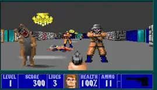
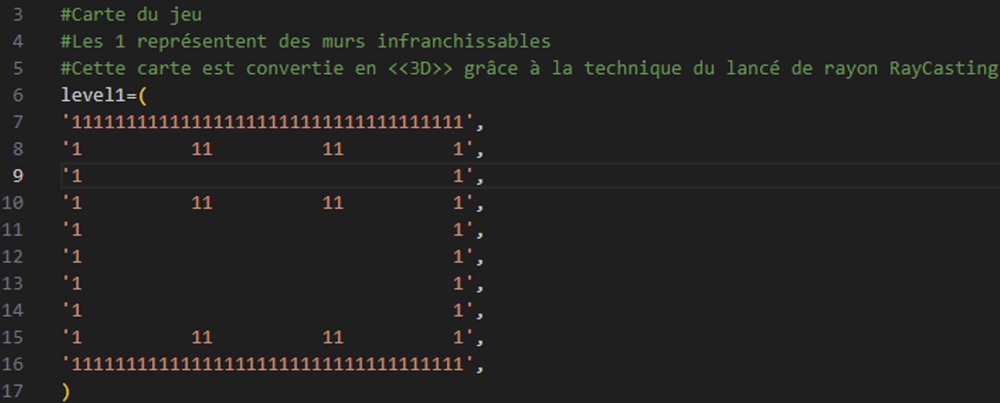
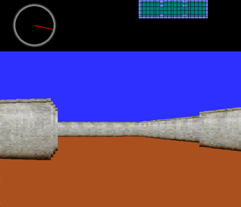
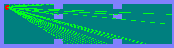

# Mon propre prototype d’un moteur de RayCasting

En 1992 est sortie une petite révolution vidéoludique sur PC. A une époque où les consoles ne faisaient encore pratiquement que de la 2D, le premier FPS (First Person Shooter => Jeu de tirs en vue subjective) pointait le bout de son nez sur PC. Son nom : Wolfenstein 3D.

Il utilisait alors un moteur graphique à base de Ray Casting, qui donnait l’illusion d’avoir à faire à un monde en 3 dimensions.
Le but de mon mini-projet était d’expérimenter cette ancienne technique, pour en comprendre les principaux mécanismes.

## Bon alors, le ray-Casting c’est quoi ?
[Source wikipédia](https://fr.wikipedia.org/wiki/Raycasting)

Il s’agit d'une technique pour transformer un monde en 2 dimensions à base d’espace (pour simuler le sol) et de 1 (pour simuler les murs), en un monde en 3 dimensions (les murs prennent de la hauteur): 

Le monde en deux dimensions en question se trouve dans le fichier level.py :

Le rendu final:

Pour ce faire, dans le monde en 2D, on va lancer des rayons invisibles depuis la caméra vers les murs, calculer la taille de chacun de ces rayons et afficher les murs en conséquence.
Plus un rayon est grand est donc un mur est loin, plus celui-ci apparaîtra petit à l’écran. 

## Pour faire fonctionner le programme :
- Installer Python
- Importer le projet soit avec les commandes git, soit en téléchargeant les fichiers avec l’interface de github.
- Ouvrir le répertoire téléchargé et tester votre installation de python en ouvrant une fenêtre de commande, puis en entrant la commande suivante : `py --version` 
Normalement votre version de python doit apparaître
- Installer la librairie **pygame**: `pip install pygame`
- Exécuter simplement le fichier main.bat

L’application doit alors se lancer.

## Les touches:

|Touches |Actions|
|----------------------------------|----------------------------------|
|z	|Avancer|
|s	|Reculer|
|q	|Tourner à gauche|
|d	|Tourner à droite|
|t	|Activer/désactiver les textures des murs|
|p	|Afficher la carte avec les indications des fameux rayons|
|8	|Regarder vers l’avant|
|9	|Regarder vers l’avant droite|
|6	|Regarder vers la droite|
|3	|Regarder vers l’arrière droite|
|2	|Regarder vers l’arrière|
|1	|Regarder vers l’arrière gauche|
|4	|Regarder vers la gauche|
|7	|Regarder vers l’avant gauche|
|Echap	|Quitter l’application|

## Objectifs:
Mon objectif ici n’était pas de créer un véritable moteur « 3D » exploitable dans un jeu. Je préfère laisser ça aux mathématiciens, infiniment meilleurs que moi dans ce domaine!

Non, mon but était simplement de me lancer un défi, à une époque où les IA comme ChatGPT n’existait pas encore, et où on ne trouvait pas tant de documentation que ça sur cette technologie. Je voulais comprendre les mécanismes par moi-même et voir si j’étais capable de les mettre en œuvre, sans regarder d’autres codes source, exemples, ou même algorithmes, le tout en un temps raisonnable.
